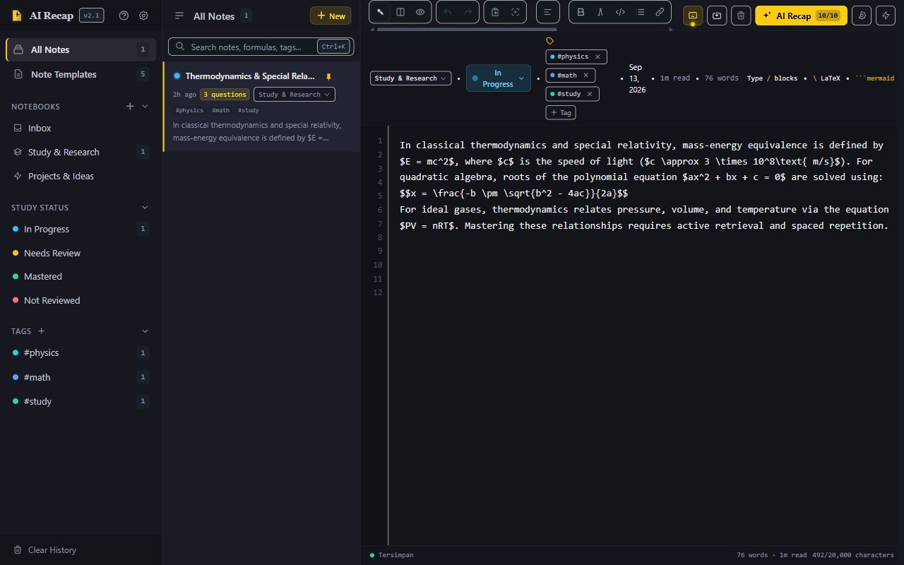
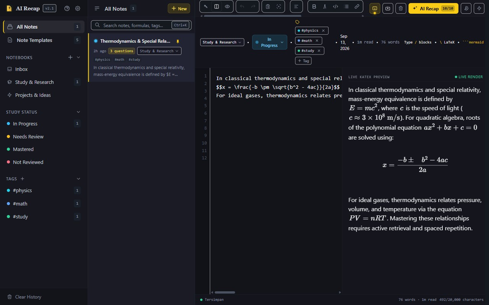

# AI Recap

> **The distraction-free study companion with active recall, flashcards, KaTeX LaTeX math rendering, Inkdrop-grade live split editor, and habit-building spaced repetition.**

Paste or write your notes, scientific formulas, lectures, or meeting transcripts. Get back a concise summary and four interactive active-recall questions to cement long-term memory.

Built with **Next.js 16 (App Router, Turbopack)**, **KaTeX Engine**, and deployed on **Tencent EdgeOne Makers**.

**🔗 Live Demo → [https://ai-recap.rth.my.id/](https://ai-recap.rth.my.id/)**

---

### Preview Demo

| Initial Screen | In Action |
| :---: | :---: |
|  |  |

---

## ✨ Key Features

#### 🖋️ 1. Inkdrop-Grade Editor with Live KaTeX Split-View & Zen Mode
- **Three Viewing Modes**:
  - **Tulis (Zen 1-Pane)**: Clean, distraction-free single-column workspace for rapid note-taking and deep focus.
  - **Split (Side-by-Side)**: Interactive monospace editor on the left with instant, sub-5ms **Live KaTeX Preview** on the right. Formulas render in real-time as you type.
  - **Preview**: Full rendered layout with formatted typography and equations.
  - **Hotkey Cycle**: Press `Ctrl+P` / `Cmd+P` to effortlessly switch between Tulis, Split, and Preview modes.
- **Smart Typist Interactions**:
  - **Auto-Pairing**: Typing `$`, `(`, `[`, or `` ` `` automatically inserts the closing symbol and places your cursor between them (`$|$`).
  - **Wrap Selection**: Select any text and type `$` to immediately wrap it in LaTeX math delimiters (`$selection$`).
  - **Smart Step-Over**: Typing a closing character when right before one cleanly steps over it without duplicate characters.
  - **Tab Indentation**: Pressing `Tab` inserts 2 spaces of code indentation instead of jumping form focus.
  - **Word Wrap Toggle**: Toggle horizontal scrolling vs. word wrap via toolbar button.
  - **Line Numbers**: Sync-scrolling line numbers gutter in edit and split views.

### ⚡ 2. Slash Commands (`/`) & 60+ Formula Autocomplete
- **Slash Commands (`/` at start of line)**: Insert structural blocks without memorizing Markdown:
  - Heading 1, 2, 3 (`#`, `##`, `###`)
  - Centered Math Block (`$$\n\n$$`)
  - Bullet List, Numbered List, Checklist (`- [ ]`)
  - Alert / Catatan Penting (`> `)
  - Code Block with syntax highlighting (`` ```typescript``` ``)
  - Comparison Tables & Dividers (`---`)
  - *Zero-interference design*: `/` only triggers when typed at the beginning of a line, never interrupting Indonesian prose (`dan/atau`, `km/jam`, `1/2`).
- **60+ Curated LaTeX Science Formulas (`\`)**:
  - Formulas are automatically auto-wrapped in `$..$` or `$$..$$` so KaTeX live preview updates immediately upon selection.
  - Non-intrusive **Docked Candidate Strip** placed below the editor that never covers your text.
  - Fast keyboard navigation: `↑` / `↓`, `Tab` / `Enter`, and `Escape` for instant dismissal.

### 🧭 3. Table of Contents (Outline Navigation Panel)
- **Automatic Heading Extraction**: Detects `#`, `##`, and `###` in real-time.
- **Collapsible Outline**: Click **Outline** in the header toolbar to preview document structure.
- **Smooth Anchor Scrolling**: Click any section in the TOC to instantly glide to that exact part of your notes.

### 🏷️ 4. Study Status Workflow & Pin to Top (Zero-Token History)
- **Study Status Lifecycle**: Assign active review statuses to each session:
  - `Draft Baru` (slate) &bull; `Sedang Belajar` (sky) &bull; `Perlu Diulang` (amber) &bull; `Dikuasai` (emerald)
- **Pin to Top**: Pin critical exam topics to the top of your drawer with the SVG pin icon.
- **Filter Chips**: Filter by `Semua`, `📌 Disematkan`, `⚠️ Perlu Diulang`, `✅ Dikuasai`, or `📝 Draft`.
- **Notebook Organization**: Create notebooks to group related notes (e.g. "Study & Research", "Projects & Ideas").
- **Save Draft Without Recap (0 Tokens)**: Save work-in-progress notes to browser storage without consuming AI tokens.

### 💻 5. Advanced Code Block Rendering
- Fenced code blocks (`` ```lang...``` ``) render with:
  - Language header pill (e.g. `TYPESCRIPT`, `PYTHON`)
  - 1-Click **Copy Code** button with `✓ Tersalin` confirmation
  - Clean line-number gutters for enhanced readability.

### 🔬 6. KaTeX LaTeX Scientific Formula Engine
- **Inline & Display Math**: Comprehensive support for inline math (`$...$`) and display equations (`$$...$$`).
- **Graceful Error Handling**: Fallback boundaries prevent crashes on malformed equations.
- **High-Performance**: Pure client-side KaTeX rendering (1–5ms per formula) with zero external CDN roundtrips and anti-XSS protection.

### 🧠 7. Spaced Repetition & The 4 Laws of Atomic Habits
- **Make it Obvious (Cue)**: Daily Study Streak badge (`● Nd streak`) tracking continuous learning habits in `localStorage`.
- **Make it Attractive (Craving)**: Elegant dark editorial typography (Slate-Ink & warm gold) with tactile micro-haptic feedback.
- **Make it Easy (Response)**: 1-Tap sample loader, drag-and-drop file import (`.txt`, `.md`), and keyboard hotkeys (`Ctrl+Enter` to recap).
- **Make it Satisfying (Reward)**: Retention scorecard percentage with **per-question review time tracking**, **Retest Missed Only** (Leitner repetition), and **Copy Missed** for Notion/Obsidian.

### 🃏 8. Dual Mode: List Accordion & Focus Flashcard Deck
- **Interactive Flashcard Mode**:
  - `Space` / `Enter` or Tap to flip and reveal answer.
  - `←` / `→` or Touch Swipe to navigate between cards (30px threshold with visual displacement feedback).
  - `1` / `k` to rate as *✓ Remembered*, `2` / `r` to rate as *⟳ Review again*.
  - Micro-haptic tactile vibration feedback on supported mobile devices.
- **Visual Recall Badges in List Mode**: Instantly spot learning gaps via `✓` (emerald) and `⟳` (amber) indicators.
- **Screen Reader Accessible**: Built with WCAG 2.1 AA compliance (`aria-live="polite"`, `role="region"`, `aria-expanded`).

### 📱 9. Mobile Ergonomics & Offline PWA
- **iOS Safari Auto-Zoom Prevention**: Textarea font sizing (`text-base sm:text-sm`) prevents forced viewport zooming on mobile devices.
- **Responsive Flex Toolbar**: Clean wrapping on narrow screens with comfortable 44px touch targets.
- **PWA Service Worker**: Full offline support with connectivity status indicator (`● Offline mode`).
- **Expanded History**: Stores up to **50 study sessions** with real-time keyword search and notebook filtering.

### 🎙️ 10. Multi-Speed Text-to-Speech (TTS)
- Web Speech API integration with automatic language detection (Indonesian `id-ID` vs English `en-US`).
- Dynamic speech rate cycling (`1.0x` → `1.25x` → `1.5x`) without interrupting playback.

### 🔍 11. Find & Replace, Merge Notes, Command Palette
- **Find & Replace** (`Ctrl+H`): Full-text search and replace within the current note.
- **Merge Notes** (`Ctrl+M`): Combine multiple notes into one with preview.
- **Command Palette** (`Ctrl+K`): Quick full-text search across all notes.

### ⌨️ 12. Global Keyboard Shortcuts
- `Ctrl+S` — Save draft instantly
- `Ctrl+Z` / `Ctrl+Y` — Global undo/redo across the editor
- `Ctrl+±` / `Ctrl+0` — Zoom in/out/reset editor font size
- `Ctrl+F` — Open Find & Replace
- `Alt+↑` / `Alt+↓` — Move current line up/down
- `Ctrl+B` / `Ctrl+I` / `Ctrl+Shift+X` — Bold / Italic / Strikethrough
- `Ctrl+1` / `Ctrl+2` / `Ctrl+3` — Heading 1/2/3
- `Ctrl+Shift+L` / `Ctrl+Shift+8` / `Ctrl+Shift+7` — Link / Bullet List / Numbered List
- `Ctrl+Shift+`` ` `` / `Ctrl+Shift+>` / `Ctrl+Shift+-` — Code Block / Blockquote / Horizontal Rule

### 📤 13. Comprehensive Export & Zero-Token Sharing
- **Complete Printable Study Sheet**: Clean `@media print` layout that prints 100% of the core summary, all questions, and all answers with sharp black math and zero blank page jumps.
- **Zero-Token Share Link**: Encodes recaps directly into a URL hash (`#recap=...`) openable anywhere with 0 AI tokens.
- **Export to Anki**: Ready-to-import TSV flashcard text files (`#separator:tab`).
- **Download Markdown**: Clean `.md` file export.
- **Export .txt**: Plain text export of notes.
- **Backup / Restore**: Full `.json` backup with merge-on-restore to avoid duplicates.
- **Copy Q&A**: 1-click copy for individual questions, complete summaries, or missed items.

### 🖼️ 14. Image Support
- **Image Upload**: Via toolbar button, clipboard paste (`Ctrl+V`), or drag-and-drop.
- **Image Rendering**: Inline images with XSS-safe sanitization via `isomorphic-dompurify`.
- **Orphan Cleanup**: Automatically removes IndexedDB images no longer referenced in any note.

---

## 🏗️ Atomic Code Architecture

The codebase is organized following **Atomic Design** principles:

```text
ai-recap/
├── components/
│   ├── atoms/                          # Pure, stateless UI elements
│   │   ├── LatexRenderer.tsx           # Safe KaTeX inline ($) & block ($$) renderer
│   │   ├── FormattedText.tsx           # Combined LaTeX + Markdown + Mermaid parser
│   │   ├── MermaidRenderer.tsx         # XSS-safe Mermaid diagram renderer
│   │   ├── Kbd.tsx                     # Standardized keyboard hotkey badges
│   │   ├── SonnerToaster.tsx           # Toast notification provider
│   │   └── ResizerDivider.tsx          # Draggable pane resizer
│   ├── molecules/                      # Functional atom combinations
│   │   ├── QuizCard.tsx                # Isolated memoized accordion card with Copy Q&A
│   │   ├── SpeechControls.tsx          # Audio TTS player & speed cycler
│   │   ├── StudyStreakBadge.tsx        # Daily habit streak badge
│   │   ├── OfflineBadge.tsx            # PWA connectivity indicator
│   │   ├── TocPanel.tsx                # Table of contents floating overlay
│   │   ├── NoteTagBar.tsx              # Interactive tag management bar
│   │   ├── NotebookDropdown.tsx         # Notebook selector dropdown
│   │   ├── StudyStatusDropdown.tsx      # Study status lifecycle selector
│   │   ├── WelcomeBanner.tsx           # Onboarding guide for empty notes
│   │   ├── ConfirmDialog.tsx           # Reusable confirmation modal
│   │   └── StorageIndicator.tsx        # IndexedDB storage usage indicator
│   └── organisms/                      # Standalone feature organisms
│       ├── NotesInput.tsx              # Inkdrop editor: split view, autocomplete, templates, shortcuts
│       ├── FlashcardDeck.tsx           # Focus flashcard deck with touch swipe & 3D flip
│       ├── RetentionScorecard.tsx      # Retention score, review time tracking, Retest Missed
│       ├── StudyCompanionPane.tsx      # Right-side AI companion panel
│       ├── HistoryDrawer.tsx           # 50-item local study history with notebook filter
│       ├── InkdropNavigation.tsx       # Left sidebar: notebooks, status filters, tags
│       ├── InkdropNoteList.tsx         # Note list with search, pin, duplicate, delete
│       ├── CommandPalette.tsx          # Ctrl+K full-text search across all notes
│       ├── FindReplaceModal.tsx        # Ctrl+H find & replace in current note
│       ├── MergeNotesModal.tsx         # Ctrl+M merge multiple notes with preview
│       ├── BackupRestoreModal.tsx      # JSON backup/restore with merge-on-restore
│       ├── CustomApiModal.tsx          # Custom AI API configuration (OpenAI-compatible)
│       └── ShortcutsModal.tsx          # Keyboard cheat-sheet modal [?]
├── hooks/
│   ├── useStudyStreak.ts              # Daily streak state & habit cycle logic
│   ├── useSpeech.ts                   # Web Speech API & voice pre-warming
│   ├── useKeyboardSound.ts            # Cherry MX Black mechanical keyboard sound
│   ├── useStorageUsage.ts             # IndexedDB storage monitoring
│   └── useResizablePanes.ts           # Draggable pane resize logic
├── lib/
│   ├── types.ts                       # Shared TypeScript definitions (QuizItem, HistoryItem, etc.)
│   ├── templates.ts                   # Academic study templates with SVG icon mappings
│   ├── latexAutocomplete.ts           # 60+ curated LaTeX math formulas & autocomplete engine
│   ├── slashCommands.ts               # Slash command definitions (/ at start of line)
│   ├── mermaidTemplates.ts            # Mermaid diagram templates (Flow, Architecture, Concept, Timeline)
│   ├── generateToc.ts                 # Automatic heading extraction for TOC
│   ├── imageStorage.ts                # IndexedDB image storage with quota management
│   ├── ai-config.ts                   # Custom API configuration (OpenAI-compatible providers)
│   ├── tags.ts                        # Tag management utilities
│   ├── haptics.ts                     # Micro-haptic tactile feedback
│   └── wordCount.ts                   # Zero-allocation linear word counter (<0.04ms)
└── app/
    ├── api/recap/route.ts             # EdgeOne AI Gateway route with multi-model fallback & 20k chars limit
    ├── layout.tsx                     # Root layout with KaTeX CSS & PWA manifest
    ├── page.tsx                       # Clean declarative top-level orchestrator
    └── globals.css                    # Ink theme, print styles, reduced motion, mobile touch targets
```

---

## 🔒 Security & AI Resilience

1. **Prompt Injection Defense**: User notes are encapsulated inside `<user_notes>` isolation tags with strict system override guards.
2. **Generous Capacity with Abuse Caps**: Supports up to **20,000 characters** (~3,500 words) per note and generates up to 1,500 output tokens.
3. **Multi-Model Fallback Chain**: Automatically cascades from primary model to backups if rate limits or outages occur:
   - Primary: `@makers/deepseek-v4-flash`
   - Fallbacks: `@makers/kimi-k2.6`, `@makers/hy3`, `@makers/minimax-m3`
4. **Origin & Anti-Abuse Shielding**: Sliding-window rate limiter (10 req/min), fair-use daily cap of **10 recaps/day** per user, and `sec-fetch-site` cross-origin blocking.
5. **SSRF Protection**: DNS rebinding TLD blocklist, hex/octal IP address blocking, `transfer-encoding` header blocking, and Content-Length guard.
6. **XSS Sanitization**: `isomorphic-dompurify` for Mermaid diagram rendering and image alt text. `sanitizeModelText` strips AI model output of HTML/script injection.
7. **Security Headers**: `Content-Security-Policy`, `Strict-Transport-Security` (HSTS), `X-Content-Type-Options: nosniff`, `Cross-Origin-Opener-Policy`, `Cross-Origin-Resource-Policy`, `X-Frame-Options: DENY`.
8. **Zero Data Retention**: 100% client-side storage — user notes and recaps are never stored or logged on any server. Generic error messages prevent information leakage.

---

## 🚀 Run Locally

### Prerequisites
- Node.js 18+
- npm or pnpm

### Setup
```bash
git clone https://github.com/rteitch/ai-recap.git
cd ai-recap
npm install
cp .env.example .env.local
```

Fill in `AI_GATEWAY_API_KEY` in `.env.local`:
```env
AI_GATEWAY_BASE_URL="https://ai-gateway.edgeone.link/v1"
AI_GATEWAY_API_KEY="your-edgeone-api-key"
AI_GATEWAY_MODEL="@makers/deepseek-v4-flash"
```

### Start Development Server
```bash
npm run dev
```
Open [http://localhost:3000](http://localhost:3000).

### Build for Production
```bash
npm run build
npm run start
```

---

## ☁️ Deploy to EdgeOne Makers

1. Push this project to your GitHub repository.
2. In the [EdgeOne Makers Console](https://edgeone.ai/), click **Import Git Repository** and select the repository.
3. Framework is detected automatically as **Next.js (App Router)** — no custom build command needed.
4. Add the three environment variables under **Project Settings → Environment Variables**:
   - `AI_GATEWAY_BASE_URL`
   - `AI_GATEWAY_API_KEY`
   - `AI_GATEWAY_MODEL`
5. Click **Deploy**. Every subsequent push to `main` redeploys automatically.

---

## 🌐 Custom Domain Setup (EdgeOne Makers + Cloudflare DNS)

To connect your custom domain (e.g., `ai-recap.rth.my.id`):

### 1. Add Domain in EdgeOne Makers
1. Open the EdgeOne Makers console → Select your project (`ai-recap`).
2. Navigate to **Domains** → Click **Add Domain** and enter your subdomain (`ai-recap.rth.my.id`).

### 2. Verify Domain Ownership (TXT Record)
- Open your **Cloudflare** dashboard → Select domain (`rth.my.id`) → **DNS** > **Records**.
- Add a new record:
  - **Type**: `TXT`
  - **Name**: `edgeonereclaim.<subdomain>` (e.g., `edgeonereclaim.ai-recap`)
  - **Content**: Enter the verification code provided by EdgeOne (e.g., `reclaim-xxxx...`)
  - **Proxy status**: **DNS only** (gray cloud)
- Return to EdgeOne Makers and click **Verify**.

### 3. Route Traffic (CNAME Record)
In Cloudflare DNS, add:
- **Type**: `CNAME`
- **Name**: `ai-recap`
- **Target**: Your default EdgeOne domain (e.g., `ai-recap-xxxx.edgeone.dev`)
- **Proxy status**: **DNS only** (gray cloud)

### 4. Automatic SSL
- Propagation takes 1–5 minutes.
- EdgeOne automatically issues and manages free SSL/TLS HTTPS certificates.

---

## 📄 License

MIT &copy; [RTH Nexus](https://rth.my.id). All rights reserved.
