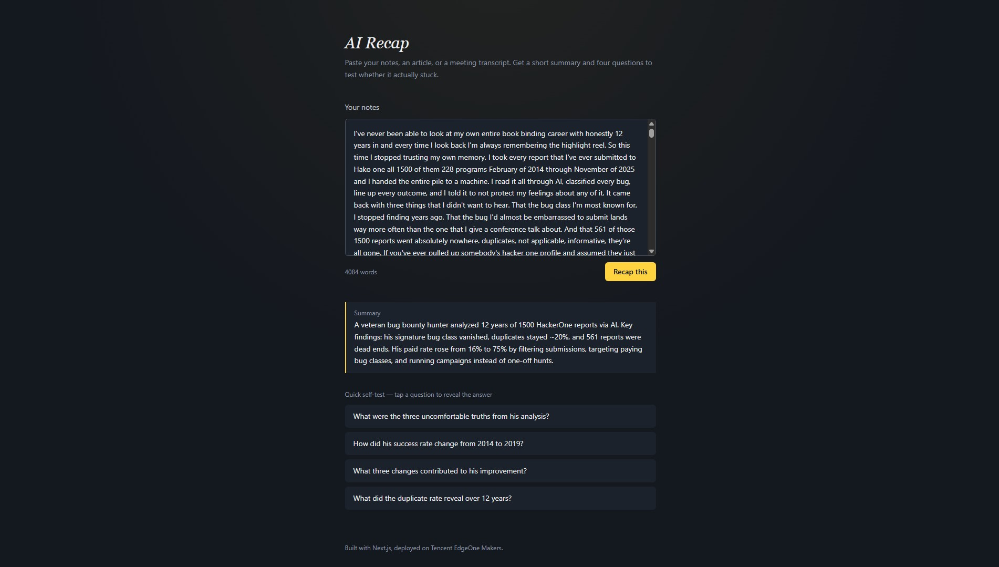

# AI Recap

Paste a chunk of notes, an article, or a meeting transcript. Get back a short
summary and four quiz questions to test whether it actually stuck.

Built with Next.js (App Router) and deployed on **Tencent EdgeOne Makers**.

**🔗 Live demo → https://ai-recap-dp8ka8dt4dc4.edgeone.dev/**



## What this project touches on EdgeOne Makers

- Git-based deployment (push to `main`, Makers builds and deploys automatically)
- Zero-config Next.js support (no custom build command needed)
- A serverless function (`app/api/recap/route.ts`) calling an LLM
- The built-in AI Gateway / model gateway (`@makers/deepseek-v4-flash`, free tier)
- Environment variables managed from the Makers console

## Run it locally

```bash
npm install
cp .env.example .env.local
# fill in AI_GATEWAY_API_KEY in .env.local
npm run dev
```

Open http://localhost:3000.

## Get an AI Gateway API key

1. Sign in to the Makers console.
2. Enable Makers on your account if you haven't already.
3. Open the Models / AI Gateway section and create a gateway API key.
4. Copy it into `AI_GATEWAY_API_KEY` (local `.env.local`, and later into the
   Makers project's environment variables for the deployed version).

The built-in `@makers/deepseek-v4-flash` model comes with a free token
allowance, so no other provider key is required to try this out.

## Deploy to EdgeOne Makers

1. Push this project to a GitHub repository.
2. In the Makers console, choose **Import Git Repository** and select the repo.
3. Framework is detected automatically (Next.js) — no build command changes needed.
4. Add the three environment variables from `.env.example` under
   Project Settings -> Environment Variables (use your real API key).
5. Deploy. Every subsequent push to `main` redeploys automatically; pushes to
   other branches get their own preview URL.

## Notes for the write-up

- [x] First deploy: **succeeded** on first attempt — no errors.
- [x] Config adjustments: 3 environment variables set via the Makers console UI (`AI_GATEWAY_API_KEY`, `AI_GATEWAY_BASE_URL`, `AI_GATEWAY_MODEL`).
- [x] AI Gateway: The `@makers/deepseek-v4-flash` built-in model is **free** with a daily quota — no credit card or DeepSeek account needed. API key is generated directly from the Makers Models → API Key console page.
